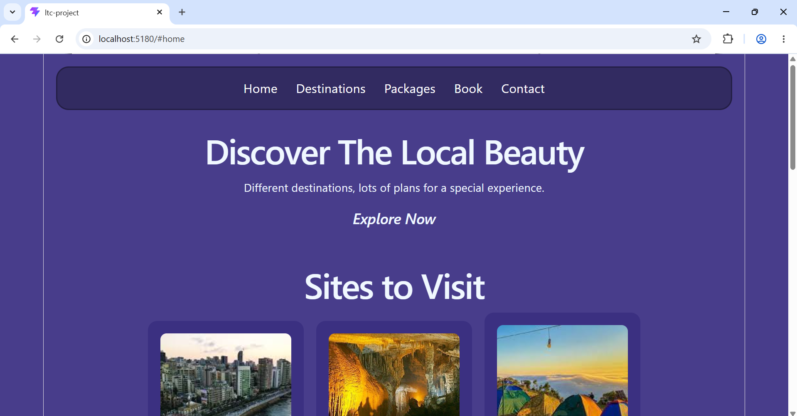
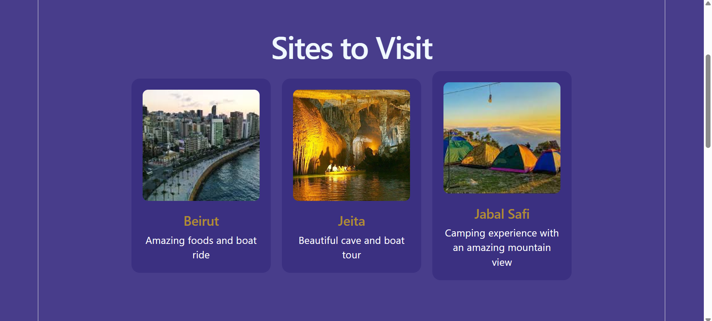
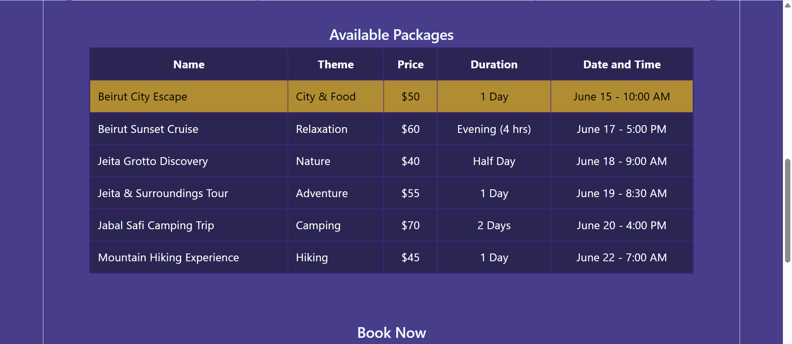
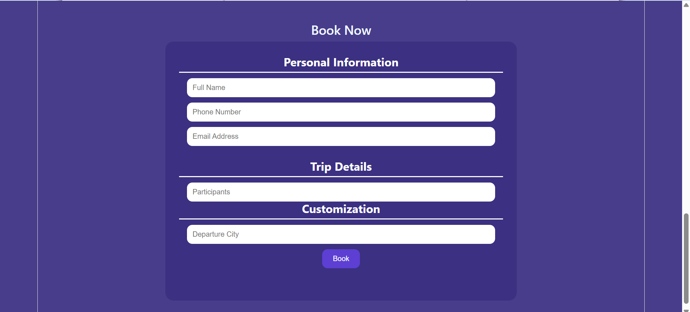

# LTC React Project

## Project Description

LTC React Project is a responsive tourism website built using ReactJS.
The website allows users to explore destinations, view available packages, and submit booking information through a booking form.

## Technologies Used

* ReactJS
* CSS
* Vite
* Git & GitHub

## Features

* Responsive Design
* Navigation Bar
* Destinations Section
* Packages Table
* Booking Form
* Smooth Scrolling

## Setup Instructions

1. Clone the repository:

```bash
git clone https://github.com/batoulawadi/ltc-react-project.git
```

2. Install dependencies:

```bash
npm install
```

3. Run the project:

```bash
npm run dev
```

## Screenshots

### Home Page


### Destinations Page


### Packages Page


### Booking Form
